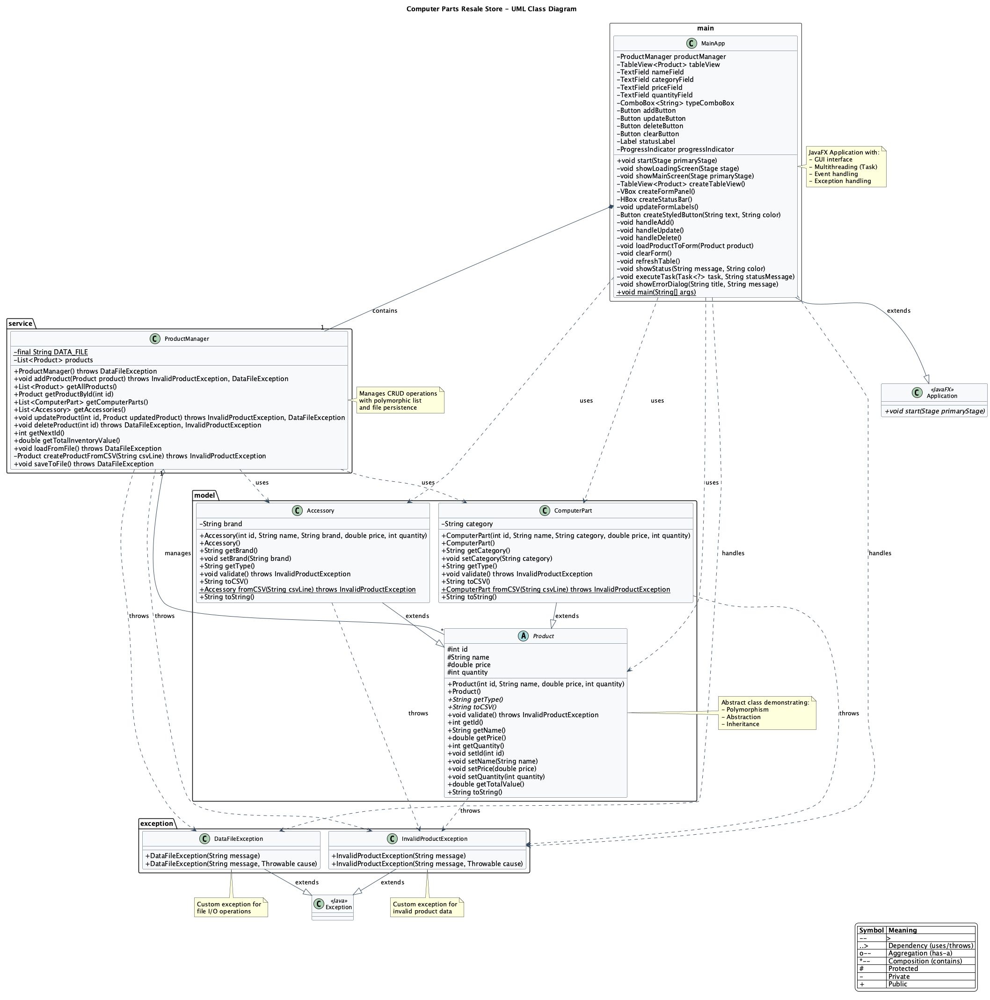

# Computer Parts Resale Store

A comprehensive JavaFX application demonstrating **fundamental and advanced OOP concepts** including CRUD operations, polymorphism, exception handling, and multithreading.

---

## 📋 Table of Contents

1. [Quick Start](#-quick-start)
2. [Features](#-features)
3. [UML Class Diagram](#-uml-class-diagram)
4. [OOP Concepts Demonstrated](#-oop-concepts-demonstrated)
5. [Project Structure](#-project-structure)
6. [Setup Instructions](#-setup-instructions)
7. [Advanced Features](#-advanced-features-explained)
8. [Code Explanation](#-code-explanation)
9. [Usage Guide](#-usage-guide)
10. [Testing](#-testing-the-features)
11. [Troubleshooting](#-troubleshooting)
12. [Customization](#-customization)

---

## 🚀 Quick Start

### Three Simple Steps:

1. **Open Project** in your IDE (IntelliJ IDEA, Eclipse, or VS Code)
2. **Import as Maven Project** - IDE will detect `pom.xml` and download JavaFX automatically
3. **Run** `src/MainApp.java`

**Or use command line:**
```bash
cd computer-parts-resale-store
mvn clean compile
mvn javafx:run
```

That's it! The application will start with a loading screen and display the inventory manager.

---

## 🎯 Features

### Core Features
- ✅ **Create**: Add new products (Computer Parts or Accessories)
- ✅ **Read**: View all products in a table format
- ✅ **Update**: Edit existing product information
- ✅ **Delete**: Remove products from inventory
- ✅ **Data Persistence**: Store data in comma-separated text files

### Advanced Features ⭐
- ✅ **Polymorphism**: Support for multiple product types with shared interface
- ✅ **Exception Handling**: Custom exceptions with user-friendly error dialogs
- ✅ **Multithreading**: Background operations with loading indicators
- ✅ **Input Validation**: Comprehensive validation with proper error messages
- ✅ **Type Safety**: Compile-time type checking with abstract classes
- ✅ **Progress Indicators**: Visual feedback during all operations
- ✅ **Loading Screen**: Professional startup experience
- ✅ **Responsive UI**: Never freezes thanks to background threading

---

## 🎨 UML Class Diagram

The following UML diagram illustrates the complete class structure, relationships, and OOP principles used in this project:



### Key Relationships:
- **Inheritance**: `ComputerPart` and `Accessory` extend the abstract `Product` class
- **Composition**: `MainApp` contains a `ProductManager` instance
- **Aggregation**: `ProductManager` manages a collection of `Product` objects
- **Dependencies**: Exception classes are used throughout for error handling
- **Polymorphism**: All product types can be treated as `Product` objects

> **Note**: The diagram source file is available in [UML-ClassDiagram.puml](UML-ClassDiagram.puml) and can be edited with PlantUML tools.

---

## 📚 OOP Concepts Demonstrated

### Fundamental Concepts (6)
1. **Encapsulation**: Private fields with public getters/setters
2. **Abstraction**: Abstract parent class with abstract methods
3. **Constructors**: Multiple constructors (default and parameterized)
4. **File I/O**: Reading and writing data to `.txt` files
5. **Collections**: Using `ArrayList<Product>` to manage data
6. **Event Handling**: JavaFX button clicks and table selections

### Advanced Concepts (9) ⭐
7. **Polymorphism**: Parent-child class hierarchy with method overriding
8. **Exception Handling**: Custom exception classes and proper error propagation
9. **Multithreading**: JavaFX `Task` and `Platform.runLater()` for responsive UI
10. **Inheritance**: Product parent class with ComputerPart and Accessory children
11. **Type Checking**: `instanceof` operator and safe downcasting
12. **Method Overriding**: Child classes override parent abstract methods
13. **Abstract Classes**: Cannot be instantiated, define contract for children
14. **Factory Method**: Polymorphic object creation based on type
15. **Try-with-resources**: Automatic resource management for file operations

---

## 📁 Project Structure

```
computer-parts-resale-store/
│
├── src/
│   ├── MainApp.java (530 lines)
│   │   └─ JavaFX Application with multithreading
│   │
│   ├── model/
│   │   ├── Product.java (90 lines)
│   │   │   └─ Abstract parent class
│   │   ├── ComputerPart.java (85 lines)
│   │   │   └─ Child class with 'category' field
│   │   └── Accessory.java (85 lines)
│   │       └─ Child class with 'brand' field
│   │
│   ├── service/
│   │   └── ProductManager.java (210 lines)
│   │       └─ CRUD operations with exception handling
│   │
│   └── exception/
│       ├── InvalidProductException.java
│       │   └─ Custom exception for validation errors
│       └── DataFileException.java
│           └─ Custom exception for file I/O errors
│
├── data/
│   └── products.txt
│       └─ CSV data storage with type prefix
│
├── pom.xml
│   └─ Maven configuration (manages JavaFX dependencies)
│
└── README.md
    └─ This comprehensive documentation
```

**Total**: 7 Java classes, ~1000 lines of code, 15 OOP concepts

---

## 🛠️ Setup Instructions

### Prerequisites
- **Java JDK 11 or higher** ([Download](https://www.oracle.com/java/technologies/downloads/))
- **Maven** (optional but recommended) ([Install Guide](https://maven.apache.org/install.html))

### Method 1: Maven (Recommended) ⭐

**Easiest method - no manual JavaFX download needed!**

#### Using IntelliJ IDEA:
1. Open IntelliJ IDEA
2. **File → Open** → Select the `computer-parts-resale-store` folder
3. IntelliJ detects `pom.xml` → Click **"Load Maven Project"**
4. Wait for Maven to download dependencies (~30 seconds)
5. Right-click `MainApp.java` → **Run 'MainApp.main()'**
6. ✅ Done!

#### Using Eclipse:
1. Open Eclipse
2. **File → Import → Maven → Existing Maven Projects**
3. Browse to `computer-parts-resale-store` → Click **Finish**
4. Wait for Maven to download dependencies
5. Right-click `MainApp.java` → **Run As → Java Application**
6. ✅ Done!

#### Using VS Code:
1. Install extensions: **Extension Pack for Java** and **Maven for Java**
2. **File → Open Folder** → Select project folder
3. VS Code detects `pom.xml` automatically
4. Wait for Maven sync
5. Click **Run** button above `public static void main`
6. ✅ Done!

#### Using Command Line:
```bash
cd computer-parts-resale-store
mvn clean compile    # Compile the project
mvn javafx:run       # Run the application
```

### Method 2: Manual JavaFX Setup

If you can't use Maven, follow these steps:

1. **Download JavaFX SDK**:
   - Go to [https://openjfx.io/](https://openjfx.io/)
   - Download SDK for your OS
   - Extract to a location (e.g., `/Users/you/javafx-sdk-21`)

2. **Configure IDE**:
   
   **IntelliJ IDEA**:
   - File → Project Structure → Libraries
   - Click **+** → Java → Navigate to JavaFX `lib` folder
   - Click OK
   - Run → Edit Configurations → Add VM options:
     ```
     --module-path /path/to/javafx-sdk/lib --add-modules javafx.controls
     ```

   **Eclipse**:
   - Right-click project → Build Path → Configure Build Path
   - Libraries → Add External JARs
   - Select all `.jar` files from JavaFX `lib` folder
   - Run Configurations → Arguments → VM arguments:
     ```
     --module-path /path/to/javafx-sdk/lib --add-modules javafx.controls
     ```

3. **Run**: Right-click `MainApp.java` → Run

### Verifying Installation

When successfully running, you should see:
- ✅ Loading screen with progress indicator
- ✅ Main window with "Computer Parts Resale Store" title
- ✅ Table showing 8 sample products (5 Computer Parts + 3 Accessories)
- ✅ Form panel on the right with input fields
- ✅ Status bar showing total inventory value

---

## 🌟 Advanced Features Explained

### 1. Exception Handling 🔴

#### Custom Exception Classes

**`InvalidProductException`**
```java
public class InvalidProductException extends Exception {
    public InvalidProductException(String message) {
        super(message);
    }
}
```
Used for: Empty fields, negative prices, validation errors

**`DataFileException`**
```java
public class DataFileException extends Exception {
    public DataFileException(String message, Throwable cause) {
        super(message, cause);
    }
}
```
Used for: File I/O errors, permission issues, corrupted data

#### Where Exception Handling is Used

**In Product Validation:**
```java
public void validate() throws InvalidProductException {
    if (name == null || name.trim().isEmpty()) {
        throw new InvalidProductException("Product name cannot be empty");
    }
    if (price < 0) {
        throw new InvalidProductException("Price cannot be negative");
    }
}
```

**In File Operations:**
```java
public void saveToFile() throws DataFileException {
    try (BufferedWriter writer = new BufferedWriter(new FileWriter(DATA_FILE))) {
        // Write data...
    } catch (IOException e) {
        throw new DataFileException("Error saving data file", e);
    }
}
```

**In GUI with User Dialogs:**
```java
catch (InvalidProductException e) {
    showErrorDialog("Validation Error", e.getMessage());
}
```

**Key Features:**
- ✅ Try-with-resources for automatic cleanup
- ✅ Exception chaining to preserve error context
- ✅ Checked exceptions for compile-time safety
- ✅ User-friendly error messages in dialogs
- ✅ Graceful error recovery

---

### 2. Polymorphism 🔷

#### Class Hierarchy

```
         Product (abstract)
         /              \
        /                \
   ComputerPart      Accessory
   (category)         (brand)
```

#### Abstract Parent Class

```java
public abstract class Product {
    protected int id;
    protected String name;
    protected double price;
    protected int quantity;
    
    // Abstract methods - MUST be implemented by children
    public abstract String getType();
    public abstract String toCSV();
    
    // Concrete method - CAN be overridden
    public void validate() throws InvalidProductException {
        if (name == null || name.trim().isEmpty()) {
            throw new InvalidProductException("Name cannot be empty");
        }
    }
    
    // Common method available to all products
    public double getTotalValue() {
        return price * quantity;
    }
}
```

#### Child Classes

**ComputerPart** (extends Product):
```java
public class ComputerPart extends Product {
    private String category;  // CPU, GPU, RAM, etc.
    
    @Override
    public String getType() {
        return "ComputerPart";
    }
    
    @Override
    public String toCSV() {
        return getType() + "," + id + "," + name + "," + category + "," + price + "," + quantity;
    }
    
    @Override
    public void validate() throws InvalidProductException {
        super.validate();  // Call parent validation
        if (category == null || category.trim().isEmpty()) {
            throw new InvalidProductException("Category cannot be empty");
        }
    }
}
```

**Accessory** (extends Product):
```java
public class Accessory extends Product {
    private String brand;  // Logitech, Razer, etc.
    
    @Override
    public String getType() {
        return "Accessory";
    }
    
    @Override
    public String toCSV() {
        return getType() + "," + id + "," + name + "," + brand + "," + price + "," + quantity;
    }
}
```

#### Polymorphism in Action

**1. Polymorphic Storage:**
```java
List<Product> products = new ArrayList<>();  // Can hold any Product type
products.add(new ComputerPart(...));          // Add ComputerPart
products.add(new Accessory(...));             // Add Accessory
```

**2. Polymorphic Method Calls:**
```java
for (Product product : products) {
    writer.write(product.toCSV());  // Calls correct version based on actual type
    double value = product.getTotalValue();  // Same method for all
}
```

**3. Type Checking and Downcasting:**
```java
if (product instanceof ComputerPart) {
    ComputerPart part = (ComputerPart) product;  // Safe downcast
    String category = part.getCategory();         // Access child-specific method
}
```

**4. Factory Method Pattern:**
```java
private Product createProductFromCSV(String csvLine) {
    String type = csvLine.split(",")[0];
    switch (type) {
        case "ComputerPart":
            return ComputerPart.fromCSV(csvLine);
        case "Accessory":
            return Accessory.fromCSV(csvLine);
    }
}
```

**Benefits:**
- ✅ Code reusability - common behavior in parent
- ✅ Extensibility - easy to add new product types
- ✅ Flexibility - single list holds multiple types
- ✅ Maintainability - changes in one place

---

### 3. Multithreading 🧵

#### Why Multithreading?

Without multithreading: File I/O freezes the GUI ❌  
With multithreading: GUI stays responsive ✅

#### JavaFX Task Pattern

```java
Task<Void> loadTask = new Task<Void>() {
    @Override
    protected Void call() throws Exception {
        // This runs in BACKGROUND THREAD
        productManager = new ProductManager();  // Load data from file
        return null;
    }
    
    @Override
    protected void succeeded() {
        // This runs on JAVAFX THREAD when complete
        Platform.runLater(() -> {
            showMainScreen(primaryStage);
            showStatus("Loaded successfully!");
        });
    }
    
    @Override
    protected void failed() {
        // This runs on JAVAFX THREAD if error occurs
        Platform.runLater(() -> {
            showErrorDialog("Load Error", getException().getMessage());
        });
    }
};

// Start the background thread
new Thread(loadTask).start();
```

#### Multithreaded Operations

**1. Application Startup:**
```java
@Override
public void start(Stage primaryStage) {
    showLoadingScreen(primaryStage);  // Show immediately
    
    Task<Void> loadTask = new Task<Void>() {
        protected Void call() throws Exception {
            productManager = new ProductManager();  // Load in background
            return null;
        }
    };
    new Thread(loadTask).start();
}
```

**2. Add Product:**
```java
Task<Void> addTask = new Task<Void>() {
    protected Void call() throws Exception {
        Product product = new ComputerPart(...);
        productManager.addProduct(product);  // Save to file in background
        return null;
    }
    
    protected void succeeded() {
        Platform.runLater(() -> {
            refreshTable();
            showStatus("Product added!");
        });
    }
};
executeTask(addTask, "Adding product...");
```

**3. Update Product:**
```java
Task<Void> updateTask = new Task<Void>() {
    protected Void call() throws Exception {
        productManager.updateProduct(id, updatedProduct);
        return null;
    }
};
new Thread(updateTask).start();
```

**4. Delete Product:**
```java
Task<Void> deleteTask = new Task<Void>() {
    protected Void call() throws Exception {
        productManager.deleteProduct(id);
        return null;
    }
};
new Thread(deleteTask).start();
```

#### Platform.runLater() for UI Updates

**Important Rule:** Only JavaFX Application Thread can update UI!

```java
// ❌ WRONG - will crash
new Thread(() -> {
    statusLabel.setText("Done!");  // Can't update UI from background thread
}).start();

// ✅ CORRECT
new Thread(() -> {
    // Do background work...
    Platform.runLater(() -> {
        statusLabel.setText("Done!");  // UI update on JavaFX thread
    });
}).start();
```

#### Progress Indicators

```java
private void executeTask(Task<?> task, String statusMessage) {
    showStatus(statusMessage, "#3498db");
    progressIndicator.setVisible(true);  // Show spinner
    
    task.setOnSucceeded(e -> progressIndicator.setVisible(false));
    task.setOnFailed(e -> progressIndicator.setVisible(false));
    
    new Thread(task).start();
}
```

**Benefits:**
- ✅ Responsive UI - never freezes
- ✅ Better UX - loading indicators
- ✅ Professional feel
- ✅ Proper error handling in background

---

## 📝 Code Explanation

### Product.java (Abstract Parent)
**Location**: `src/model/Product.java` (90 lines)

**Purpose**: Defines the contract for all products

**Key Features:**
- Abstract class (cannot be instantiated)
- Protected fields (accessible to children)
- Abstract methods `getType()` and `toCSV()` (must be implemented)
- Concrete method `validate()` (can be overridden)
- Common method `getTotalValue()` (used by all)

**Demonstrates**: Abstraction, Encapsulation, Polymorphism

---

### ComputerPart.java (Child Class)
**Location**: `src/model/ComputerPart.java` (85 lines)

**Purpose**: Represents computer parts (CPU, GPU, RAM, etc.)

**Key Features:**
- Extends Product
- Additional field: `category`
- Overrides `getType()` to return "ComputerPart"
- Overrides `toCSV()` with category
- Overrides `validate()` to check category

**Demonstrates**: Inheritance, Method Overriding, Polymorphism

---

### Accessory.java (Child Class)
**Location**: `src/model/Accessory.java` (85 lines)

**Purpose**: Represents accessories (Mouse, Keyboard, Headset, etc.)

**Key Features:**
- Extends Product
- Additional field: `brand`
- Overrides `getType()` to return "Accessory"
- Overrides `toCSV()` with brand
- Different implementation than ComputerPart

**Demonstrates**: Polymorphism, Multiple Inheritance Paths

---

### ProductManager.java (Service Layer)
**Location**: `src/service/ProductManager.java` (210 lines)

**Purpose**: Handles CRUD operations and file I/O

**Key Methods:**
- `addProduct(Product)` - Create
- `getAllProducts()` - Read all
- `getProductById(int)` - Read one
- `updateProduct(int, Product)` - Update
- `deleteProduct(int)` - Delete
- `loadFromFile()` - Load with exception handling
- `saveToFile()` - Save with exception handling
- `createProductFromCSV()` - Factory method

**Demonstrates**: Exception Handling, Polymorphism, Factory Pattern

---

### MainApp.java (View/Controller)
**Location**: `src/MainApp.java` (530 lines)

**Purpose**: JavaFX GUI with multithreading

**Key Components:**
- `start()` - Application entry with loading screen
- `createTableView()` - Polymorphic table display
- `createFormPanel()` - Input form
- `handleAdd()` - Background task for adding
- `handleUpdate()` - Background task for updating
- `handleDelete()` - Background task for deleting
- `executeTask()` - Task execution with progress

**Demonstrates**: Multithreading, Exception Handling, Event Handling, GUI

---

### Exception Classes
**Location**: `src/exception/`

**InvalidProductException.java**: For validation errors (empty fields, negative values)  
**DataFileException.java**: For file I/O errors (permission denied, corrupted data)

**Demonstrates**: Custom Exception Classes, Exception Handling

---

## 💡 Usage Guide

### Adding a Product

1. **Select Type**: Choose "Computer Part" or "Accessory" from dropdown
2. **Fill Form**:
   - Name: Product name
   - Category/Brand: Depends on type selected
   - Price: Numeric value (e.g., 99.99)
   - Quantity: Integer value (e.g., 10)
3. **Click "Add Product"**: Progress indicator shows briefly
4. **Success**: Product appears in table, status shows "Product added successfully!"

**Error Handling**: If you leave fields empty or enter invalid data, you'll see a user-friendly error dialog.

### Updating a Product

1. **Select Row**: Click any product in the table
2. **Form Auto-fills**: All fields populate with selected product data
3. **Modify Fields**: Change any values you want
4. **Click "Update Product"**: Changes are saved
5. **Success**: Table refreshes, status shows "Product updated successfully!"

### Deleting a Product

1. **Select Row**: Click the product to delete
2. **Click "Delete Product"**: Confirmation dialog appears
3. **Confirm**: Click OK to delete, Cancel to abort
4. **Success**: Product removed, status shows "Product deleted successfully!"

### Clearing the Form

- Click **"Clear Form"** to reset all fields and deselect table row
- Useful when you want to add a new product after viewing an existing one

---

## 🧪 Testing the Features

### Test Polymorphism

1. **Add Computer Part**:
   - Type: Computer Part
   - Name: AMD Ryzen 9 5900X
   - Category: CPU
   - Price: 449.99
   - Quantity: 5

2. **Add Accessory**:
   - Type: Accessory
   - Name: Corsair K70 RGB
   - Brand: Corsair
   - Price: 169.99
   - Quantity: 12

3. **Verify**:
   - Both appear in same table
   - "Type" column shows ComputerPart vs Accessory
   - "Details" column shows Category vs Brand
   - Check `data/products.txt` - lines start with type

### Test Exception Handling

1. **Empty Name**: Leave name blank → Click Add → See error dialog
2. **Negative Price**: Enter -50 in price → See validation error
3. **Invalid Input**: Enter "abc" in price → See number format error
4. **Corrupt File**: Edit `products.txt` incorrectly → Restart app → See load error

All errors show user-friendly messages in dialog boxes!

### Test Multithreading

1. **Startup**: Watch loading screen appear
2. **Add Product**: Notice progress indicator (brief spinner)
3. **Click Around**: Try clicking buttons during operations
4. **Verify**: GUI never freezes, remains clickable

### Test Data Persistence

1. Add several products
2. Close the application
3. Reopen the application
4. Verify: All products are still there
5. Check `data/products.txt` to see saved data

---

## ❗ Troubleshooting

### "The import javafx cannot be resolved"

**Cause**: IDE hasn't loaded Maven project yet

**Solution**:
1. Look for Maven notification in IDE → Click "Load Maven Project"
2. Or right-click `pom.xml` → "Add as Maven Project"
3. Or: **View → Tool Windows → Maven** → Click refresh icon (↻)
4. Wait for dependencies to download
5. Errors will disappear

### "Cannot find or load main class MainApp"

**Cause**: Project not compiled or wrong directory

**Solution**:
```bash
mvn clean compile
mvn javafx:run
```

### "Module javafx.controls not found"

**Cause**: JavaFX not configured properly

**Solution**: Use Maven method (easiest) or add VM options:
```
--module-path /path/to/javafx-sdk/lib --add-modules javafx.controls
```

### Application Won't Start

**Check**:
1. ✅ Java 11+ installed? (`java -version`)
2. ✅ Maven installed? (`mvn -version`)
3. ✅ Opened entire project folder (not just src)?
4. ✅ Maven imported? (Look for "External Libraries" with JavaFX)

### GUI Freezes / Not Responding

This shouldn't happen with multithreading! If it does:
1. Check console for errors
2. Verify `Platform.runLater()` is used for UI updates
3. Ensure tasks are running in background threads

---

## 📊 Data Storage Format

### File Location
`data/products.txt`

### Format
```
type,id,name,category_or_brand,price,quantity
```

### Example Data
```
ComputerPart,1,Intel Core i7-13700K,CPU,399.99,15
ComputerPart,2,NVIDIA RTX 4070,GPU,599.99,8
ComputerPart,3,Corsair Vengeance 32GB,RAM,129.99,25
ComputerPart,4,Samsung 980 Pro 1TB,SSD,149.99,20
ComputerPart,5,ASUS ROG Strix B650,Motherboard,249.99,10
Accessory,6,Logitech G502 Mouse,Logitech,79.99,30
Accessory,7,Razer BlackWidow Keyboard,Razer,139.99,15
Accessory,8,HyperX Cloud II Headset,HyperX,99.99,20
```

**Note**: First field is product type, enabling polymorphic loading!

---

## 🎨 Customization

### Adding New Product Types

1. Create new class extending `Product`:
```java
public class Software extends Product {
    private String licenseType;
    
    @Override
    public String getType() { return "Software"; }
    
    @Override
    public String toCSV() { 
        return getType() + "," + id + "," + name + "," + licenseType + "," + price + "," + quantity;
    }
}
```

2. Update factory method in `ProductManager`:
```java
case "Software":
    return Software.fromCSV(csvLine);
```

3. Add to GUI type selection:
```java
typeComboBox.getItems().addAll("Computer Part", "Accessory", "Software");
```

### Changing Colors

Edit colors in `createStyledButton()`:
```java
private Button createStyledButton(String text, String color) {
    // Change these hex colors:
    // Green:  #27ae60
    // Blue:   #3498db  
    // Red:    #e74c3c
    // Gray:   #95a5a6
}
```

### Adding New Fields

1. Add field to appropriate model class
2. Update `toCSV()` and `fromCSV()` methods
3. Add column to TableView
4. Add TextField to form panel
5. Update add/update handlers

---

## 📈 Project Statistics

- **Programming Language**: Java 11+
- **GUI Framework**: JavaFX 21
- **Build Tool**: Maven 3.9+
- **Total Classes**: 7
- **Total Lines of Code**: ~1000
- **Model Classes**: 3 (Product, ComputerPart, Accessory)
- **Service Classes**: 1 (ProductManager)
- **Exception Classes**: 2
- **GUI Classes**: 1 (MainApp)
- **OOP Concepts**: 15
- **Design Patterns**: Factory Method, MVC-like
- **Architecture**: Model-Service-Exception-View

---

## 🎓 Learning Path

### Week 1: Fundamentals
- Study `Product.java` (abstract class)
- Understand encapsulation and abstraction
- Review constructors and getters/setters

### Week 2: Polymorphism
- Study `ComputerPart.java` and `Accessory.java`
- Understand inheritance and method overriding
- See how both work with same parent

### Week 3: Exception Handling
- Study exception classes in `exception/` folder
- See usage in `ProductManager.java`
- Understand try-catch, exception chaining

### Week 4: Multithreading
- Study `MainApp.java` Task implementations
- Understand JavaFX Task lifecycle
- Learn `Platform.runLater()` usage

### Week 5: Integration
- See how all concepts work together
- Modify code and experiment
- Add new features

---

## 🎯 Perfect For

- ✅ CSE215 or similar OOP courses
- ✅ Learning Java fundamentals
- ✅ Understanding advanced OOP concepts
- ✅ JavaFX GUI development
- ✅ Course projects and assignments
- ✅ Portfolio projects

---

## 📚 Additional Resources

- **JavaFX Documentation**: [openjfx.io/javadoc](https://openjfx.io/javadoc/17/)
- **Java Tutorials**: [docs.oracle.com/javase/tutorial](https://docs.oracle.com/javase/tutorial/)
- **Maven Guide**: [maven.apache.org/guides](https://maven.apache.org/guides/)
- **Exception Handling**: [docs.oracle.com/javase/tutorial/essential/exceptions](https://docs.oracle.com/javase/tutorial/essential/exceptions/)
- **Multithreading**: [docs.oracle.com/javase/tutorial/essential/concurrency](https://docs.oracle.com/javase/tutorial/essential/concurrency/)

---

## ⚠️ Important Notes

- Data is automatically saved after each operation
- Application creates `data/` folder if it doesn't exist
- ID numbers are auto-generated sequentially
- All operations are validated before execution
- File operations run in background threads
- UI remains responsive during all operations

---

## 📄 License

Free to use for educational purposes.

---

## 🤝 Contributing

This is a learning project. Feel free to:
- Add new product types
- Implement search/filter functionality
- Add data export features
- Improve UI design
- Add more validation rules
- Create unit tests

---

## 🎉 Success Criteria

Your project successfully demonstrates:
- ✅ All fundamental OOP concepts
- ✅ **Exception Handling** with custom exceptions
- ✅ **Polymorphism** with abstract classes and inheritance  
- ✅ **Multithreading** with responsive UI
- ✅ Professional GUI development
- ✅ Real-world application design
- ✅ Clean, maintainable code

---

**🚀 Happy Coding!**

If you have questions or issues, review the Troubleshooting section or check the code comments for detailed explanations.
